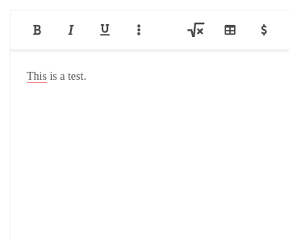

# GTP3-cheat
### A chrome extension that allows you to cheat on exam.net using OpenAi's API.
# READ BEFORE USING!
I am not responsible for any consequences that may arise from the use of this software. The use of this software is at your own risk. It is your responsibility to comply with all relevant laws and school policies regarding academic integrity and cheating. If you are caught using this software, it is your sole responsibility to face any consequences that may result. By using this software, you acknowledge that you understand and accept these terms.

## How to install
1. Download .zip or clone with the git command line tool.
2. Make an account on the [OpenAi website](https://beta.openai.com/account/api-keys) and generate a token.
3. Create a file in the src directory named `secrets.js`. Paste the following in it -> `const token = "replace this with your token";`
2. Open chrome. Click the three dots in the top right corner -> more tools -> extensions.
3. Click "load unpacked" and select the folder you downloaded in step 1. Make sure to enable it.
4. Done!

## How to use
1. Log into an exam on exam.net.
2. To start press shift+ctrl. You will see a small dot in the page title if you did it correctly.

3. Type what you want to ask the AI. You can see what you have typed in the title of the page. When you are done, press ctrl + alt. The title should go back to normal.
4. Wait a couple of seconds, then click inside of a text box, and the answer from the AI should appear in it.

